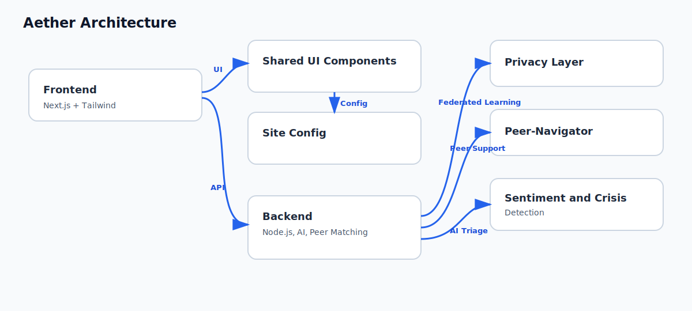
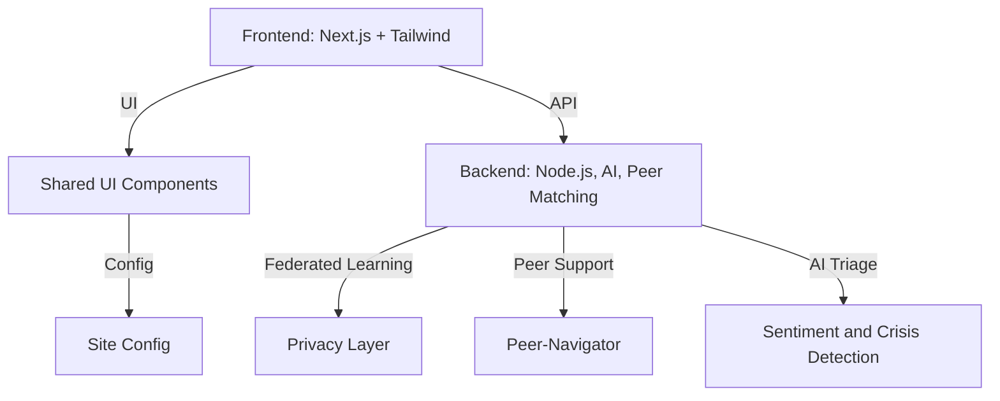

# Aether: The Student Resiliency Ecosystem

<p align="center">
  
</p>

<p align="center">
  <b>Empowering students, educators, and institutions with privacy-first, research-driven digital tools for mental health resilience.</b>
</p>

---

## 🌟 Why Aether?

- **Holistic Student Support:** Safe, anonymous, and culturally responsive space for emotional well-being.
- **AI-Augmented Triage:** Real-time sentiment and crisis detection with human-in-the-loop escalation.
- **Peer-Navigator Network:** Connects students to trained peers for support and community.
- **Privacy & Data Ethics:** Federated learning, zero-knowledge proofs, and SAFE-AI compliance.
- **Resilience Pathway:** Personalized resources and interventions for growth.
- **Accessibility by Design:** Fully responsive, mobile-friendly, and WCAG-compliant.

---

## 🧩 Architecture Overview



---

## 🚦 Quickstart

1. **Install dependencies**
   ```bash
   npm install
   ```
2. **Run the development server**
   ```bash
   npm run dev
   ```
3. **Open the app**
   Visit [http://localhost:3000](http://localhost:3000) in your browser.

### Environment Variables

Set these for production deployments:

```bash
NEXT_PUBLIC_SITE_URL=https://your-domain.example
NODE_ENV=production
PORT=3000
HOSTNAME=0.0.0.0
BACKEND_PORT=8080
```

---

## ✅ Quality Gates

Run these before opening a pull request:

```bash
npm run lint
npm run typecheck
npm run test:ci
npm run build
```

Or run a local verification bundle:

```bash
npm run check
```

---

## 🚀 Deployment

### Vercel

1. Import this repository in Vercel.
2. Use the repository root as the project root.
3. Set `NEXT_PUBLIC_SITE_URL` to your production URL.
4. Deploy using the included [vercel.json](vercel.json).
5. Vercel is configured to install from the public npm registry and ignore the checked-in lockfile during its hosted install step.

### Netlify

1. Import this repository in Netlify.
2. Keep the base directory as repository root.
3. Netlify uses [netlify.toml](netlify.toml) to build and run Next.js.
4. Set `NEXT_PUBLIC_SITE_URL` in Netlify environment variables.
5. Netlify is configured to override npm install flags so hosted installs use the public registry instead of the corporate `.npmrc`.

### Other Providers

The frontend app is standard Next.js 14 and can be deployed to any provider that supports Node.js 20+ and the `next build` + `next start` flow.

### Corporate Network Note

Local installs continue to use the corporate registry defined in [.npmrc](.npmrc). Hosted deployments override that behavior explicitly in [vercel.json](vercel.json) and [netlify.toml](netlify.toml).

### Docker

Build and run the production container:

```bash
docker build -t aether .
docker run --rm -p 3000:3000 --env-file .env.example aether
```

### Health Checks

- Frontend: `/api/health`
- Backend: `/health`

---

## 🛠️ Core Features

- **Echo Chamber:** Voice-enabled journaling, NLP-based crisis detection, and total anonymity.
- **AI-Triage & Sentiment Mapping:** Real-time analysis of text/voice for wellness mapping and escalation.
- **Peer-Navigator Network:** Peer matching, culturally responsive support, and quality feedback.
- **Privacy & Data Ethics:** Federated learning, zero-knowledge proofs, and SAFE-AI compliance.
- **Resilience Pathway:** Guided user journey, progress tracking, and personalized resources.
- **Accessibility:** WCAG-compliant UI, mobile-first, ethical and explainable AI.

---

## 🧑‍💻 Design Philosophy

- **Generic & Modular:** All components are prop-driven, themeable, and framework-agnostic.
- **User-Friendly:** Clear language, onboarding flows, tooltips, and demo/playground mode.
- **Maintainable:** Strict TypeScript, code linting, tests, and clear separation of concerns.
- **Visually Appealing:** Modern color palette, subtle animations, responsive layouts, and professional iconography.
- **Accessible:** WCAG 2.2 AA, keyboard navigation, ARIA, dark mode, and i18n-ready.

---

## 📸 Screenshots

<!-- Add screenshots/gifs here -->

---

## ❓ FAQ

**Q: Is my data private?**  
A: Yes. Aether uses federated learning and zero-knowledge proofs. No raw data ever leaves your device.

**Q: Can I use Aether for my institution?**  
A: Absolutely! Aether is modular and can be customized for any educational environment.

**Q: How do I contribute?**  
A: See [CONTRIBUTING.md](CONTRIBUTING.md) for guidelines.

**Q: Is Aether accessible?**  
A: Yes. The UI is fully WCAG-compliant and mobile-first.

---

## 📚 References & Research

- RAND (2025): Competency of Large Language Models in Evaluating Appropriate Responses to Suicidal Ideation.
- Huntsman Mental Health Institute (2026): Scalable Agile Framework for Execution in AI (SAFE AI).
- Pennebaker, J.W. (1997): Writing about emotional experiences as a therapeutic process.
- Frontiers in Medicine (2025): Validating GenAI feedback in suicide prevention training.

---

## 🤝 Contributing

See [CONTRIBUTING.md](CONTRIBUTING.md) for guidelines.

## 📝 License

[MIT](LICENSE)

## Author

Aarti Sri Ravikumar
