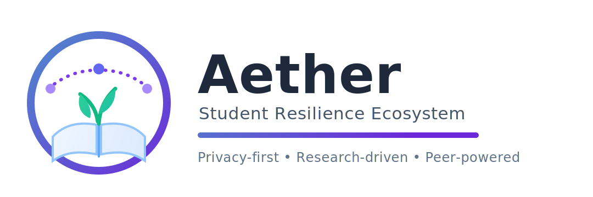

# Aether

Aether is a privacy-first student resilience platform that combines
journaling, sentiment-aware guidance, and peer-support pathways in a
production-ready monorepo.

<p align="center">
  
</p>

<p align="center">
  
</p>

## What This Repository Contains

- `apps/frontend`: Next.js 14 App Router web experience (TypeScript + Tailwind)
- `apps/backend`: Node.js HTTP service for health checks and future APIs
- `content/blog`: Markdown-backed blog content
- `docs`: Product and algorithm documentation (including peer matching specs)
- `packages/shared-ui`: Workspace placeholder for shared component library
- `packages/site-config`: Workspace placeholder for centralized configuration

## Tech Stack

- Node.js 20.x
- npm 10+
- Next.js 14.2.x
- React 18
- TypeScript 5.4.x
- Jest + Testing Library

## Quick Start

### Prerequisites

- Node.js `20.x`
- npm `>=10`

### Install

```bash
npm install
```

### Run Frontend (Default Dev Flow)

```bash
npm run dev
```

Open `http://localhost:3000`.

### Run Backend (Optional in Parallel)

```bash
npm --workspace=apps/backend run dev
```

Default backend URL: `http://localhost:8080`.

## Workspace Scripts

From repository root:

- `npm run dev`: start frontend dev server
- `npm run build`: production build (frontend)
- `npm run start`: serve production frontend build
- `npm run lint`: lint frontend
- `npm run typecheck`: typecheck frontend
- `npm run test`: run frontend and backend tests
- `npm run test:ci`: frontend tests with coverage
- `npm run check`: lint + typecheck + test

## Environment Variables

### Frontend

Core:

- `NEXT_PUBLIC_SITE_URL`: canonical base URL for metadata/sitemap/robots
  (recommended in production)

Echo runtime:

- `NEXT_PUBLIC_ECHO_ENABLE_BROWSER_MODELS`: set to `true` to enable
  optional browser local-model path

Blog source adapters:

- `BLOG_SOURCE`: `local-markdown` (default) or `remote-json`
- `BLOG_CONTENT_DIR`: optional override for markdown directory
- `BLOG_REMOTE_JSON_URL`: required when `BLOG_SOURCE=remote-json`

Giscus comments (required to enable comments):

- `NEXT_PUBLIC_GISCUS_REPO`
- `NEXT_PUBLIC_GISCUS_REPO_ID`
- `NEXT_PUBLIC_GISCUS_CATEGORY`
- `NEXT_PUBLIC_GISCUS_CATEGORY_ID`

Giscus optional overrides:

- `NEXT_PUBLIC_GISCUS_MAPPING` (default `pathname`)
- `NEXT_PUBLIC_GISCUS_STRICT` (default `0`)
- `NEXT_PUBLIC_GISCUS_REACTIONS_ENABLED` (default `1`)
- `NEXT_PUBLIC_GISCUS_EMIT_METADATA` (default `0`)
- `NEXT_PUBLIC_GISCUS_INPUT_POSITION` (default `bottom`)
- `NEXT_PUBLIC_GISCUS_THEME` (default `light_high_contrast`)
- `NEXT_PUBLIC_GISCUS_LANG` (default `en`)

### Backend

- `BACKEND_PORT` (preferred)
- `PORT` (fallback)

## Health Endpoints

- Frontend: `GET /api/health`
- Backend: `GET /health`

Quick checks:

```bash
curl -s http://localhost:3000/api/health
curl -s http://localhost:8080/health
```

## Blog Content Model

Place posts in `content/blog` using this front matter:

```md
---
title: Your post title
date: 2026-04-02
excerpt: One-line summary
tags: product, updates, resilience
---
```

When using `BLOG_SOURCE=remote-json`, the endpoint must return an array of:

```json
[
  {
    "slug": "my-post",
    "title": "My Post",
    "date": "2026-04-02",
    "excerpt": "Summary",
    "tags": ["updates"],
    "content": "## Markdown body"
  }
]
```

## Deployment

### Vercel

1. Import repository.
2. Use repository root.
3. Set `NEXT_PUBLIC_SITE_URL`.
4. Deploy with `vercel.json`.

### Netlify

1. Import repository.
2. Use repository root.
3. Set `NEXT_PUBLIC_SITE_URL`.
4. Deploy with `netlify.toml`.

### Docker

Build and run frontend production image:

```bash
docker build -t aether .
docker run --rm -p 3000:3000 --env-file apps/frontend/.env.example aether
```

## Architecture and Specs

- Peer matching algorithm: [docs/peer-matching-algorithm.md](docs/peer-matching-algorithm.md)
- Peer matching API/service contracts: [docs/peer-matching-service-contracts.md](docs/peer-matching-service-contracts.md)

## Quality Gates

Recommended before opening a pull request:

```bash
npm run lint
npm run typecheck
npm run test:ci
npm run build
```

Or run one command:

```bash
npm run check
```

## Troubleshooting

- If metadata/canonical URLs look incorrect in production, verify `NEXT_PUBLIC_SITE_URL`.
- If local blog content does not appear, verify `BLOG_CONTENT_DIR` or keep
  default `content/blog`.
- Avoid deleting `.next` as part of `dev` scripts, especially with multiple
  running dev processes.

## Contributor Onboarding

### First-Time Setup

```bash
git clone <your-repository-url>
cd aether
nvm use 20 || echo "Install/use Node 20.x before continuing"
npm install
npm run check
npm run dev
```

### First PR Workflow

```bash
git checkout -b docs/your-change-name
# make your changes
npm run check
git add -A
git commit -m "docs: improve contributor onboarding"
git push -u origin docs/your-change-name
```

Then open a pull request against `main` and include:

1. What changed.
2. Why it changed.
3. How you validated it (commands + results).

### Good First Changes

- Add or improve tests near touched code.
- Improve docs for setup, env vars, and deployment.
- Tighten type safety for existing modules.
- Fix small accessibility and UX bugs in the frontend.

## Contributing

- [CONTRIBUTING.md](CONTRIBUTING.md)
- [CODE_OF_CONDUCT.md](CODE_OF_CONDUCT.md)

## License

[MIT](LICENSE)
