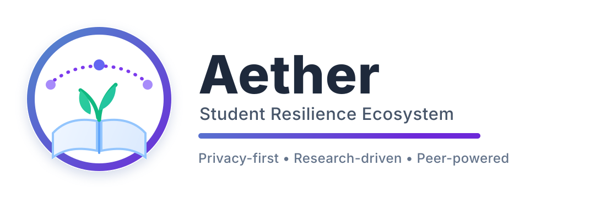
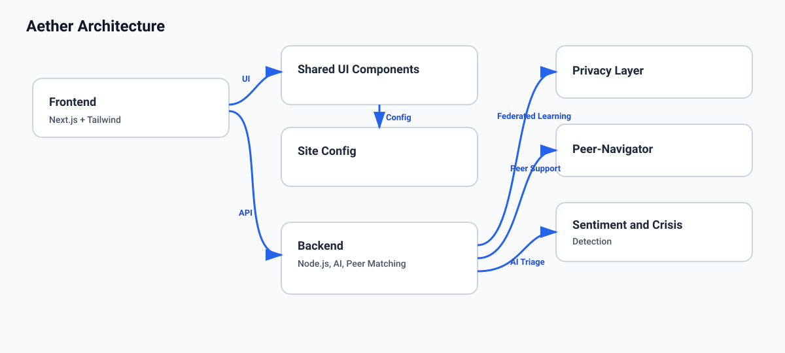

# Aether

**Live website:** [aether.ai-aarti.com](https://aether.ai-aarti.com/) · **Project Wiki:** [GitHub Wiki](https://github.com/aartisr/aether/wiki) · **Source:** [aartisr/aether](https://github.com/aartisr/aether)

Aether is a privacy-first student resilience platform designed as a serious, research-grounded operating system for early support, reflection, and peer connection.

## Hosted instance and open-source participation

An instance of Aether is hosted at [aether.ai-aarti.com](https://aether.ai-aarti.com/). This is an open-source project, and we warmly welcome people who want to help make student support more humane, private, accessible, and accountable. Whether you contribute code, research, accessibility insight, documentation, design, safety review, or thoughtful feedback, your participation can help strengthen a project built to serve people with care and dignity. Please begin with the [contribution guide](CONTRIBUTING.md) and [code of conduct](CODE_OF_CONDUCT.md).

For research and reuse, please cite the project using [CITATION.cff](CITATION.cff); GitHub will surface a ready-to-use citation after it is merged into the default branch.

It is written with ambition, but it should be read with clarity: Aether does not claim to replace therapy, clinical care, crisis services, or the human judgment required in high-stakes support. Its purpose is to make earlier, safer, more compassionate support more accessible and more operationally trustworthy.

It brings together three ideas that are usually fragmented across campus tools:

- private, voice-enabled reflection that can become structured insight without exporting raw emotion to a server,
- guided resilience experiences that help a student move from overload to one concrete next step,
- and governed peer-support operations that treat recruitment, safety, fairness, and auditability as first-class product concerns rather than afterthoughts.

This repository is not just a landing page or a demo. It is a production-oriented monorepo with a modern web application, admin operations, policy-aware peer workflows, local analysis flows, content systems, and deployment hardening.

The ambition is deliberately high: build a system that feels humane at the moment of need, rigorous under operational scrutiny, and credible to researchers, funders, and campus leaders who need more than product theater.

The tone of this project matters. It is intended to be kind without becoming vague, innovative without becoming careless, and persuasive without overstating what the current implementation can actually do.

<p align="center">
  
</p>

<p align="center">
  
</p>

## Why Aether Exists

Student support products often fail in one of two ways:

- they are emotionally warm but operationally thin,
- or they are operationally rigorous but psychologically cold.

Aether is built to close that gap.

The product direction is grounded in patterns from student mental health, peer support, mentoring practice, digital safety, fairness governance, and privacy-by-design. The core design principle is simple: when a student is under strain, the product should reduce friction, increase clarity, and preserve dignity.

That leads to several non-negotiables:

- crisis help must always remain explicit and easy to reach,
- reflective tooling must not require a student to surrender unnecessary data,
- peer support should be matched and operated with governance rather than optimism,
- and intelligent features should be explainable enough to audit and improve.

## Why This Matters Now

Student wellbeing products are entering a harder phase of maturity. It is no longer enough to ship a friendly interface, add a chatbot, and claim support. The next generation of systems will be judged by a tougher standard:

- do they reduce friction without disguising risk,
- do they preserve privacy while still producing useful signal,
- do they support human helpers without burning them out,
- and do they create evidence trails strong enough for real institutional adoption.

Aether is built inside that standard. It is meant to feel credible not because it sounds intelligent, but because its product claims, operational controls, and technical decisions can be inspected side by side.

## What Makes Aether Feel Prize-Caliber

Not because it is louder than other products, but because it tries to solve the right hard problems at the same time.

### Research depth

Aether is informed by work across peer support, mentoring operations, campus mental health, resilience design, fairness governance, safety escalation, privacy-by-design, and trustworthy AI. The system documentation is part of the product story because evidence should shape implementation, not just marketing.

### Systems thinking

The repository treats student support as an operating system composed of journeys, safeguards, queues, roles, audits, matching logic, fallback behavior, and deployment realities. That is a stronger frame than feature accumulation.

### Human-centered rigor

The strongest flows in Aether aim to do two things simultaneously: lower emotional effort for the student and increase operational clarity for the organization. That tension is where the real design work lives.

### Honesty about scope

Aether is strongest when it is explicit about what is implemented, what is experimental, and where human oversight remains essential. That is why the repository includes architecture notes, operating specs, route-level tests, runbooks, and feature trackers alongside the product code itself.

### Implementation honesty

The repo does not pretend that product claims are enough. It includes tests, runbooks, contracts, queueing logic, RBAC validation, deployment hardening, local fallbacks, and route-level governance because trustworthy systems need operational proof.

## What Makes This Repo Distinct

This codebase combines product storytelling, operational depth, and implementation detail in one place.

### 1. Private Voice Reflection With Local Analysis

The Echo experience supports voice capture, editable transcript flow, playback, and local sentiment and safety mapping. The recorder is built to degrade gracefully across browser capabilities and now includes:

- clearer microphone and browser compatibility errors,
- live transcript text-pad behavior,
- audio playback after capture,
- browser speech-recognition fallback messaging,
- and regression-tested recording and transcription flows.

### 2. A Resilience Hub That Behaves Like a Real Support Surface

The Resilience Hub is designed as a modular intervention space rather than a generic wellness page. It includes check-ins, safety planning, resource navigation, peer-circle discovery, and habit planning in a single flow that can orient a student quickly without forcing account creation first.

### 3. Peer Support As an Operated System, Not a Marketing Page

The peer recruitment and peer operations work in this repo goes beyond listing volunteers. It includes:

- canonical peer lifecycle types,
- lifecycle and readiness transitions,
- incident opening and resolution workflows,
- audit capture and export,
- peer CRUD through admin UI and API,
- role-based admin access,
- persistence abstraction with file, memory, and Postgres backends,
- and forecasting, fairness, and worker-queue infrastructure.

### 4. Governance Built Into the Product Surface

Fairness, policy, and audit concerns are visible in the implementation, not deferred to a slide deck. Admin and governance surfaces are wired into the same repo as the user-facing product, which makes the system more realistic and more defensible.

### 5. CMS Flexibility Without Losing Native Product Depth

The frontend supports CMS-driven content through Puck while preserving native-only routes for experiences that require richer interactive behavior. This lets narrative pages evolve quickly without destabilizing complex product surfaces.

## Latest Feature Highlights

The current repository includes the following major capabilities.

### Student-facing experiences

- **Echo Chamber**: voice-enabled reflection with editable transcript, playback, local analysis, and safety-aware guidance.
- **Resilience Pathway**: a structured hub for check-ins, safety planning, peer-circle matching, care navigation, and habit planning.
- **Peer Navigator**: a privacy-aware peer support pathway with matching and operational scaffolding.
- **Ask Aether**: question-led support and information triage.
- **Blog and journal content**: markdown-backed and optionally remote-fed educational content.

### Admin and governance experiences

- **Peer admin console** for create, update, lifecycle control, incidents, and audit review.
- **Role-based access control** with reviewer, operator, and owner scopes.
- **Fairness and governance views** tied to actual recruitment and audit data.
- **CMS/page controls** for content and route exposure management.

### Platform capabilities

- **Pluggable persistence** for peer recruitment data.
- **Manual worker execution support** for recruitment queue jobs.
- **Deployment hardening for Vercel** including public-registry-safe install behavior.
- **Tested local analysis flows** for echo and voice capture.

## Research Orientation

This repository is intentionally documentation-rich because the product claims are meant to be inspectable.

The standard here is not “does this sound visionary?” The standard is “can someone trace the vision into architecture, policy, user experience, and code?” That is the kind of rigor serious student-support technology needs.

Key design and research artifacts include:

- [docs/ARCHITECTURE.md](docs/ARCHITECTURE.md)
- [docs/peer-matching-algorithm.md](docs/peer-matching-algorithm.md)
- [docs/peer-matching-service-contracts.md](docs/peer-matching-service-contracts.md)
- [docs/peer-navigator-network-implementation-plan.md](docs/peer-navigator-network-implementation-plan.md)
- [docs/peer-recruitment-operating-spec.md](docs/peer-recruitment-operating-spec.md)
- [docs/peer-recruitment-execution-plan.md](docs/peer-recruitment-execution-plan.md)
- [docs/peer-recruitment-feature-tracker.md](docs/peer-recruitment-feature-tracker.md)
- [docs/admin-rbac-rollout-runbook.md](docs/admin-rbac-rollout-runbook.md)

The goal is not to present Aether as magically complete or clinically authoritative. The goal is to show a product that takes evidence, privacy, peer operations, and system design seriously enough to encode them into the implementation.

## Search, GEO, and AI Discovery

Aether ships with a serious public-discovery layer: canonical page metadata, Open Graph previews, structured data, XML and image sitemaps, RSS, crawler policy, and citation-ready AI retrieval files at [`/llms.txt`](apps/frontend/src/app/llms.txt/route.ts) and [`/llms-full.txt`](apps/frontend/src/app/llms-full.txt/route.ts). The full launch and editorial checklist is in [docs/SEARCH_DISCOVERY.md](docs/SEARCH_DISCOVERY.md).

## Repository Layout

- `apps/frontend`: Next.js 14 App Router web application
- `apps/backend`: lightweight Node.js backend surface for health checks and future APIs
- `content/blog`: markdown-backed long-form content
- `docs`: product, architecture, algorithm, and operating documentation
- `packages/shared-ui`: placeholder workspace for extracted UI components
- `packages/site-config`: placeholder workspace for centralized configuration

## Tech Stack

- Node.js `22.x`
- npm `>=10`
- Next.js `14.2.x`
- React `18`
- TypeScript `5.4.x`
- Tailwind CSS `3`
- Jest + Testing Library
- Puck CMS
- Optional in-browser model tooling via `@xenova/transformers`

## Quick Start

### Prerequisites

- Node.js `22.x`
- npm `>=10`

### Install

```bash
npm install
```

### Run the frontend

```bash
npm run dev
```

Open `http://localhost:3000`.

### Run the backend in parallel

```bash
npm --workspace=apps/backend run dev
```

Default backend URL: `http://localhost:8080`.

## Workspace Scripts

From repository root:

- `npm run dev`: start frontend dev server
- `npm run build`: production build for frontend
- `npm run start`: serve production frontend build
- `npm run lint`: lint frontend
- `npm run typecheck`: typecheck frontend
- `npm run test`: run frontend and backend tests
- `npm run test:ci`: frontend tests with coverage
- `npm run check`: lint + typecheck + test

Frontend-specific operational scripts:

- `npm --workspace=apps/frontend run admin:rbac:validate`
- `npm --workspace=apps/frontend run workers:run:once`
- `npm --workspace=apps/frontend run rag:index`

## Environment Variables

### Frontend

Core:

- `NEXT_PUBLIC_SITE_URL`: canonical base URL for metadata, sitemap, and robots

PostHog (optional, privacy-first defaults):

- `NEXT_PUBLIC_POSTHOG_KEY`: public PostHog project key. When absent, the SDK is not requested or initialized.
- `NEXT_PUBLIC_POSTHOG_HOST`: ingestion host; defaults to `https://us.i.posthog.com`.
- `NEXT_PUBLIC_POSTHOG_ENABLED`: set to `false` to hard-disable analytics even when a key exists.
- `NEXT_PUBLIC_POSTHOG_PERSISTENCE`: defaults to in-memory session storage. Set to `localStorage` only after an appropriate consent decision.

The integration disables autocapture and session recording, captures only deliberate product events, and rejects common free-form/PII property names. Use `track('event_name', { safe_property: 'value' })` from `src/lib/analytics.ts`; never include user text, contact data, transcripts, audio, or safety information.

Echo runtime:

- `NEXT_PUBLIC_ECHO_ENABLE_BROWSER_MODELS=true` to enable optional local model paths in the browser

Blog source adapters:

- `BLOG_SOURCE`: `local-markdown` (default) or `remote-json`
- `BLOG_CONTENT_DIR`: optional override for markdown content directory
- `BLOG_REMOTE_JSON_URL`: required when `BLOG_SOURCE=remote-json`

Admin RBAC and session security:

- `AETHER_ENABLE_ADMIN_PAGE=true`
- `AETHER_ADMIN_SESSION_SECRET`
- `AETHER_ADMIN_SESSION_TTL_MINUTES`
- `AETHER_ADMIN_OWNER_KEYS`
- `AETHER_ADMIN_OPERATOR_KEYS`
- `AETHER_ADMIN_REVIEWER_KEYS`

Legacy owner-key compatibility remains supported through:

- `AETHER_ADMIN_ACCESS_KEY`
- `AETHER_ADMIN_ACCESS_KEYS`

Suggested production template:

```bash
AETHER_ENABLE_ADMIN_PAGE=true
AETHER_ADMIN_SESSION_SECRET=replace-with-64+char-random-secret
AETHER_ADMIN_SESSION_TTL_MINUTES=240
AETHER_ADMIN_OWNER_KEYS=owner-key-1,owner-key-2
AETHER_ADMIN_OPERATOR_KEYS=operator-key-1,operator-key-2
AETHER_ADMIN_REVIEWER_KEYS=reviewer-key-1,reviewer-key-2
```

Recruitment worker queue:

- `PEER_RECRUITMENT_WORKER_QUEUE_PATH`
- `PEER_RECRUITMENT_WORKER_API_KEY`
- `PEER_RECRUITMENT_INCIDENT_SLA_HOURS`

Worker endpoints:

- `POST /api/peer-recruitment/workers/jobs`
- `GET /api/peer-recruitment/workers/jobs`
- `POST /api/peer-recruitment/workers/run`

Comments via Giscus:

- `NEXT_PUBLIC_GISCUS_REPO`
- `NEXT_PUBLIC_GISCUS_REPO_ID`
- `NEXT_PUBLIC_GISCUS_CATEGORY`
- `NEXT_PUBLIC_GISCUS_CATEGORY_ID`

Optional Giscus overrides:

- `NEXT_PUBLIC_GISCUS_MAPPING`
- `NEXT_PUBLIC_GISCUS_STRICT`
- `NEXT_PUBLIC_GISCUS_REACTIONS_ENABLED`
- `NEXT_PUBLIC_GISCUS_EMIT_METADATA`
- `NEXT_PUBLIC_GISCUS_INPUT_POSITION`
- `NEXT_PUBLIC_GISCUS_THEME`
- `NEXT_PUBLIC_GISCUS_LANG`

### Backend

- `BACKEND_PORT` (preferred)
- `PORT` (fallback)

## Health Endpoints

- Frontend: `GET /api/health`
- Backend: `GET /health`

Quick checks:

```bash
curl -s http://localhost:3000/api/health
curl -s http://localhost:8080/health
```

## Deployment

### Vercel

1. Import the repository.
2. Use repository root as the project root.
3. Set `NEXT_PUBLIC_SITE_URL` or allow Vercel system URL variables.
4. Deploy using [vercel.json](vercel.json).

The repo is configured to install from the public npm registry using [.npmrc.public](.npmrc.public) and the current Vercel install command.

### Netlify

1. Import the repository.
2. Use repository root.
3. Set `NEXT_PUBLIC_SITE_URL`.
4. Deploy with [netlify.toml](netlify.toml).

### Docker

```bash
docker build -t aether .
docker run --rm -p 3000:3000 --env-file apps/frontend/.env.example aether
```

## Quality Gates

Recommended before opening a pull request:

```bash
npm run lint
npm run typecheck
npm run test:ci
npm run build
```

Or run the aggregate check:

```bash
npm run check
```

## Troubleshooting

- If canonical URLs look wrong in production, verify `NEXT_PUBLIC_SITE_URL`.
- If voice recording fails locally, check browser microphone permissions and confirm the app is running on a secure context.
- If local blog content does not appear, verify `BLOG_CONTENT_DIR` or keep the default `content/blog`.
- Avoid deleting `.next` in dev scripts while multiple dev processes are active.

## Contributor Onboarding

### First-time setup

```bash
git clone <your-repository-url>
cd aether
npm install
npm run check
npm run dev
```

### First PR workflow

```bash
git checkout -b feature/your-change-name
# make changes
npm run check
git add -A
git commit -m "feat: describe your change"
git push -u origin feature/your-change-name
```

Open a pull request against `main` and include:

1. what changed,
2. why it changed,
3. how you validated it.

## Contributing

- [CONTRIBUTING.md](CONTRIBUTING.md)
- [CODE_OF_CONDUCT.md](CODE_OF_CONDUCT.md)

## License

[MIT](LICENSE)

# Aether

Aether is a privacy-first student resilience platform that combines
journaling, sentiment-aware guidance, and peer-support pathways in a
production-ready monorepo.

<p align="center">
  
</p>

<p align="center">
  
</p>

## What This Repository Contains

- `apps/frontend`: Next.js 14 App Router web experience (TypeScript + Tailwind)
- `apps/backend`: Node.js HTTP service for health checks and future APIs
- `content/blog`: Markdown-backed blog content
- `docs`: Product and algorithm documentation (including peer matching specs)
- `packages/shared-ui`: Workspace placeholder for shared component library
- `packages/site-config`: Workspace placeholder for centralized configuration

## Tech Stack

- Node.js 22.19.0
- npm 10+
- Next.js 14.2.x
- React 18
- TypeScript 5.4.x
- Jest + Testing Library

## Quick Start

### Prerequisites

- Node.js `22.19.0`
- npm `>=10`

### Install

```bash
npm install
```

### Run Frontend (Default Dev Flow)

```bash
npm run dev
```

Open `http://localhost:3000`.

### Run Backend (Optional in Parallel)

```bash
npm --workspace=apps/backend run dev
```

Default backend URL: `http://localhost:8080`.

## Workspace Scripts

From repository root:

- `npm run dev`: start frontend dev server
- `npm run build`: production build (frontend)
- `npm run start`: serve production frontend build
- `npm run lint`: lint frontend
- `npm run typecheck`: typecheck frontend
- `npm run test`: run frontend and backend tests
- `npm run test:ci`: frontend tests with coverage
- `npm run check`: lint + typecheck + test

## Environment Variables

### Frontend

Core:

- `NEXT_PUBLIC_SITE_URL`: canonical base URL for metadata/sitemap/robots
  (recommended in production; optional on Vercel when system environment
  variables are exposed)

Echo runtime:

- `NEXT_PUBLIC_ECHO_ENABLE_BROWSER_MODELS`: set to `true` to enable
  optional browser local-model path

Blog source adapters:

- `BLOG_SOURCE`: `local-markdown` (default) or `remote-json`
- `BLOG_CONTENT_DIR`: optional override for markdown directory
- `BLOG_REMOTE_JSON_URL`: required when `BLOG_SOURCE=remote-json`

Admin RBAC and session security:

- `AETHER_ENABLE_ADMIN_PAGE`: set to `true` in production to expose admin routes
- `AETHER_ADMIN_SESSION_SECRET`: strong random secret used to sign admin sessions
- `AETHER_ADMIN_SESSION_TTL_MINUTES`: session lifetime in minutes (default `480`)
- `AETHER_ADMIN_OWNER_KEYS`: comma-separated owner keys (full admin access)
- `AETHER_ADMIN_OPERATOR_KEYS`: comma-separated operator keys (peer ops + audit + feedback)
- `AETHER_ADMIN_REVIEWER_KEYS`: comma-separated reviewer keys (audit + feedback read access)

Legacy compatibility:

- `AETHER_ADMIN_ACCESS_KEY` and `AETHER_ADMIN_ACCESS_KEYS` are still accepted as owner keys.

Suggested production template:

```bash
# Admin exposure and signing
AETHER_ENABLE_ADMIN_PAGE=true
AETHER_ADMIN_SESSION_SECRET=replace-with-64+char-random-secret
AETHER_ADMIN_SESSION_TTL_MINUTES=240

# Role-scoped keys (rotate quarterly or on staffing changes)
AETHER_ADMIN_OWNER_KEYS=owner-key-1,owner-key-2
AETHER_ADMIN_OPERATOR_KEYS=operator-key-1,operator-key-2
AETHER_ADMIN_REVIEWER_KEYS=reviewer-key-1,reviewer-key-2
```

Operational guidance:

- RBAC rollout runbook: [docs/admin-rbac-rollout-runbook.md](docs/admin-rbac-rollout-runbook.md)
- Recruitment execution plan: [docs/peer-recruitment-execution-plan.md](docs/peer-recruitment-execution-plan.md)

Recruitment worker queue:

- `PEER_RECRUITMENT_WORKER_QUEUE_PATH`: queue storage JSON path (default `.data/peer-recruitment-worker-queue.json`)
- `PEER_RECRUITMENT_WORKER_API_KEY`: optional key required by worker run endpoint (`x-worker-key` header)
- `PEER_RECRUITMENT_INCIDENT_SLA_HOURS`: SLA threshold used by incident SLA worker job (default `24`)

Worker endpoints:

- `POST /api/peer-recruitment/workers/jobs` enqueue job (`refresh_forecast`, `refresh_fairness`, `incident_sla_check`)
- `GET /api/peer-recruitment/workers/jobs` list jobs with optional `status`, `type`, `limit`
- `POST /api/peer-recruitment/workers/run` process queued jobs (optional JSON body: `{ "limit": 20 }`)

Giscus comments (required to enable comments):

- `NEXT_PUBLIC_GISCUS_REPO`
- `NEXT_PUBLIC_GISCUS_REPO_ID`
- `NEXT_PUBLIC_GISCUS_CATEGORY`
- `NEXT_PUBLIC_GISCUS_CATEGORY_ID`

Use a public discussion repository for Giscus. Do not point public deployments
at non-public project names or restricted issue/discussion surfaces.

Giscus optional overrides:

- `NEXT_PUBLIC_GISCUS_MAPPING` (default `pathname`)
- `NEXT_PUBLIC_GISCUS_STRICT` (default `0`)
- `NEXT_PUBLIC_GISCUS_REACTIONS_ENABLED` (default `1`)
- `NEXT_PUBLIC_GISCUS_EMIT_METADATA` (default `0`)
- `NEXT_PUBLIC_GISCUS_INPUT_POSITION` (default `bottom`)
- `NEXT_PUBLIC_GISCUS_THEME` (default `light_high_contrast`)
- `NEXT_PUBLIC_GISCUS_LANG` (default `en`)

### Backend

- `BACKEND_PORT` (preferred)
- `PORT` (fallback)

## Health Endpoints

- Frontend: `GET /api/health`
- Backend: `GET /health`

Quick checks:

```bash
curl -s http://localhost:3000/api/health
curl -s http://localhost:8080/health
```

## Blog Content Model

Place posts in `content/blog` using this front matter:

```md
---
title: Your post title
date: 2026-04-02
excerpt: One-line summary
tags: product, updates, resilience
---
```

When using `BLOG_SOURCE=remote-json`, the endpoint must return an array of:

```json
[
  {
    "slug": "my-post",
    "title": "My Post",
    "date": "2026-04-02",
    "excerpt": "Summary",
    "tags": ["updates"],
    "content": "## Markdown body"
  }
]
```

## Deployment

### Vercel

1. Import repository.
2. Use repository root.
3. Enable Vercel system environment variables or set `NEXT_PUBLIC_SITE_URL`
   to the production domain.
4. Deploy with `vercel.json`.

The frontend automatically prefers `NEXT_PUBLIC_SITE_URL`, then Vercel's
production/deployment URL variables, so canonical links, Open Graph images,
RSS, sitemap, image sitemap, robots, and `llms.txt` stay production-friendly.

### Netlify

1. Import repository.
2. Use repository root.
3. Set `NEXT_PUBLIC_SITE_URL`.
4. Deploy with `netlify.toml`.

### Docker

Build and run frontend production image:

```bash
docker build -t aether .
docker run --rm -p 3000:3000 --env-file apps/frontend/.env.example aether
```

## Architecture and Specs

- Peer matching algorithm: [docs/peer-matching-algorithm.md](docs/peer-matching-algorithm.md)
- Peer matching API/service contracts: [docs/peer-matching-service-contracts.md](docs/peer-matching-service-contracts.md)

## Quality Gates

Recommended before opening a pull request:

```bash
npm run lint
npm run typecheck
npm run test:ci
npm run build
```

Or run one command:

```bash
npm run check
```

## Troubleshooting

- If metadata/canonical URLs look incorrect in production, verify `NEXT_PUBLIC_SITE_URL`.
- If local blog content does not appear, verify `BLOG_CONTENT_DIR` or keep
  default `content/blog`.
- Avoid deleting `.next` as part of `dev` scripts, especially with multiple
  running dev processes.

## Contributor Onboarding

### First-Time Setup

```bash
git clone <your-repository-url>
cd aether
nvm use 22.19.0 || echo "Install/use Node 22.19.0 before continuing"
npm install
npm run check
npm run dev
```

### First PR Workflow

```bash
git checkout -b docs/your-change-name
# make your changes
npm run check
git add -A
git commit -m "docs: improve contributor onboarding"
git push -u origin docs/your-change-name
```

Then open a pull request against `main` and include:

1. What changed.
2. Why it changed.
3. How you validated it (commands + results).

### Good First Changes

- Add or improve tests near touched code.
- Improve docs for setup, env vars, and deployment.
- Tighten type safety for existing modules.
- Fix small accessibility and UX bugs in the frontend.

## Contributing

- [CONTRIBUTING.md](CONTRIBUTING.md)
- [CODE_OF_CONDUCT.md](CODE_OF_CONDUCT.md)

## License

[MIT](LICENSE)
