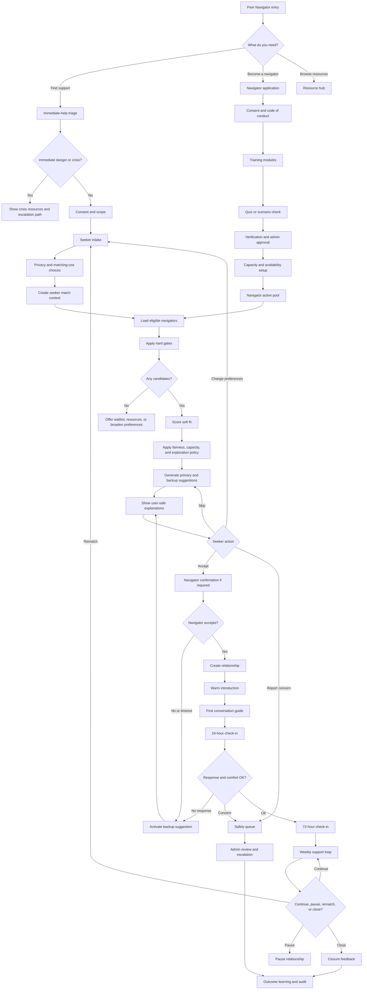

# Peer-Navigator Network Implementation Plan

Status: product, design, safety, and engineering plan  
Last updated: 2026-05-02  
Audience: product, design, engineering, trust and safety, campus/program operators  
Scope: a consent-first peer support and peer mentoring network that collects the minimum useful data, matches people safely, and keeps the relationship supported after the match.

## Executive Recommendation

Build Peer-Navigator Network as a safety-gated, explainable, human-governed support network, not as an open directory of people. The product should guide a participant through:

1. Immediate help triage.
2. Consent and scope setting.
3. Role selection: find support, offer support, or both.
4. Progressive profile intake.
5. Safety and eligibility gates.
6. Explainable match suggestions with primary and backup options.
7. Warm introduction and first-contact guidance.
8. Check-ins, reminders, reports, rematch, and closure.
9. Outcome learning and fairness audits.

The existing repo already has a strong algorithmic seed in `apps/frontend/src/lib/peer-matching/engine.ts`, plus deeper algorithm and API planning in `docs/peer-matching-algorithm.md` and `docs/peer-matching-service-contracts.md`. The main missing pieces are product operations: what data to collect, how to verify and train navigators, how to explain matches, how to keep people safe after matching, and how to make admins trust the system.

## Research Basis

This plan is grounded in patterns from peer support, student mental health, mentoring, digital health privacy, and responsible AI guidance.

| Source | Useful pattern | Implementation implication |
| --- | --- | --- |
| SAMHSA peer support workers | Peer support is based on shared understanding, respect, mutual empowerment, lived experience, resource sharing, skill building, community building, mentoring, and goals. | Make "shared context" useful, but do not reduce matching to identity overlap. Include goals, support style, boundaries, and relationship skills. |
| SAMHSA core competencies | Formal peer support needs defined competencies, training, role expectations, and supervision. | Peer navigators need status fields: applied, training, verified, active, paused, suspended. Only active verified navigators enter the pool. |
| NAMI Connection | Strong peer support uses trained leaders, structure, confidentiality, and a clear non-treatment frame. | The UX should provide a structured first conversation and make clear that peer navigation does not replace clinical care. |
| Active Minds A.S.K. | Informal support can be taught through simple, memorable steps: acknowledge, support, keep in touch. | Use a lightweight in-product conversation guide and post-match reminders, not a blank chat handoff. |
| Togetherall | Anonymous or pseudonymous peer spaces can reduce stigma, with professional moderation for safety. | Default to limited profile disclosure and let users reveal more only after mutual consent. Add moderation and review queues for reports. |
| Crisis Text Line | Volunteer support depends on application, training, active listening, safety planning, background checks, and supervisor backup. | Peer navigators need onboarding, training checkpoints, capacity limits, debriefing, and escalation routes. |
| Big Brothers Big Sisters | Matching quality comes from screening, ongoing professional support, monitoring, and safety oversight, not just pairing. | Treat matching as the start of a monitored lifecycle with check-ins and match support. |
| MENTOR Elements of Effective Practice | Effective mentoring programs define recruitment, screening, training, matching, support, closure, and evaluation. | Implement the network as an operating system with lifecycle states, not a single "find match" button. |
| Mentor Collective | Scalable mentorship matching uses onboarding surveys, configurable matching, and program-specific criteria. | Store matching criteria separately from the user profile so program admins can tune weights and requirements. |
| Systematic review of higher-ed peer support | Evidence is mixed and terminology varies; peer mentoring and peer learning showed more positive effects for stress/anxiety than some support group formats. | Be precise about the intervention type, measure outcomes honestly, and avoid claiming clinical efficacy. |
| HHS FERPA/HIPAA guidance | Student health records can trigger FERPA/HIPAA analysis depending on institution, actors, and record context. | Treat school deployments as legal-review required. Do not store clinical notes in the peer network. |
| FTC mobile health app guidance | Health-adjacent apps may face privacy, security, advertising, and breach obligations even when HIPAA does not apply. | Keep promises narrow, avoid ad SDK leakage, minimize data, and document retention/deletion. |
| NIST Privacy Framework | Privacy should be managed through enterprise risk management, not bolted on later. | Build a data inventory, purpose limits, access controls, retention policy, and privacy review before pilot. |
| NIST AI Risk Management Framework | AI-enabled systems should be trustworthy, accountable, explainable, privacy-enhancing, fair, valid, reliable, secure, and safe. | Treat the matching engine as a risk-managed recommender. Log decisions, explain factors, audit outcomes. |
| WHO AI for health ethics guidance | Health-related AI must put ethics and human rights at the center of design and deployment. | Require governance review before using sensitive data, automated ranking, or LLM-based guidance. |

## Design Principles

1. Consent first: no matching before the user understands the scope, data use, and limitations.
2. Peer support, not therapy: every screen must keep the relationship framed as peer navigation, support, mentoring, resource sharing, and encouragement.
3. Safety before relevance: no high-scoring match should bypass risk, block, training, capacity, consent, or policy gates.
4. Data minimization: collect the smallest profile that can create a useful, safe match.
5. Progressive disclosure: ask sensitive questions only when the value is clear, optional, and governed.
6. User agency: give users a primary suggestion plus backup or a short list, with simple explanations and a rematch path.
7. Human governance: admins can verify peers, review reports, audit fairness, pause matching, and change policy.
8. Relationship lifecycle: matching is only step one. Engagement, check-ins, no-response handling, burnout prevention, and closure matter more.
9. Measured humility: because student peer-support evidence is mixed, evaluate outcomes continuously and avoid overclaiming.
10. Inclusive defaults: do not assume users want identity matching. Some users want shared lived experience; others want privacy, distance, or practical topic expertise.

## Current Repo Baseline

The repo already includes:

- `apps/frontend/src/app/peer-navigator/page.tsx`: a client-side demo page for selecting a background and viewing sample matches.
- `apps/frontend/src/lib/peer-navigator-demo.ts`: hard-coded demo peers, backgrounds, and a match engine configuration.
- `apps/frontend/src/lib/peer-matching/engine.ts`: reusable three-phase matching engine with candidate generation, fairness refinement, exploration, outcome recording, and cycle metrics.
- `docs/peer-matching-algorithm.md`: detailed reciprocal matching algorithm plan.
- `docs/peer-matching-service-contracts.md`: API contracts for suggestions, accept, reject, events, and health.
- `apps/frontend/src/components/FairnessAuditDashboard.tsx`: existing admin-style audit surface for matching quality and fairness.

Primary gaps:

- No real participant intake flow.
- No profile schema for seeker and peer navigator data.
- No training, verification, capacity, or peer lifecycle state.
- No safety report or escalation model.
- No match explanation model tied to user-facing copy.
- No engagement lifecycle after the match.
- No admin queue for peer approvals, safety reports, failed matches, or fairness exceptions.
- No privacy data inventory or retention policy for sensitive profile fields.

## Target Product Experience

### Participant Entry

First screen should offer three direct paths:

- "Find support" for someone looking for a peer navigator.
- "Become a navigator" for someone offering support.
- "Browse resources" for someone who does not want to share data yet.

Before intake, show a concise scope screen:

- Peer navigators are trained peers or mentors, not clinicians.
- The network is not for emergencies.
- In the United States, show 988 for crisis support and emergency guidance.
- The user controls which optional identity and lived-experience details they share.
- The user can report, pause, block, or request a rematch.

### Seeker Flow

The seeker flow should feel like a calm intake, not a survey wall.

1. Need triage: "Is this urgent or about immediate safety?"
2. Consent: data use, peer support scope, community expectations.
3. Goal: what they want help with now.
4. Support style: listening, practical planning, accountability, resources, encouragement, lived-experience perspective.
5. Identity and lived context: optional tags with "required", "preferred", or "no preference".
6. Boundaries: topics they do not want, people they do not want to be matched with, language/modality constraints.
7. Availability: timezone, windows, response expectations.
8. Match presentation: primary plus backup, or up to three ranked choices.
9. First contact: guided intro with conversation norms.
10. Check-ins: after first contact, 24 hours, 72 hours, and weekly while active.

### Peer Navigator Flow

The navigator flow needs more trust-building and operational checks than the seeker flow.

1. Interest form: motivation, role understanding, availability, boundaries.
2. Eligibility: age, program affiliation if required, jurisdiction/campus requirements.
3. Consent and code of conduct.
4. Training: active listening, boundaries, confidentiality, crisis response, referral, cultural humility, platform safety.
5. Verification: email/domain, admin approval, reference/background check if required by program.
6. Practice: sample scenarios or quiz.
7. Capacity: max active matches, max weekly hours, preferred topics.
8. Activation: visible in pool only after all required status gates pass.
9. Support: debrief option, pause button, burnout check-ins, admin review if reports occur.
10. Closure: relationship ending norms and reactivation path.

## Data Collection Strategy

### Collection Rules

- Ask only what directly improves safety, matching, engagement, or governance.
- Separate public/display profile fields from private matching-only fields.
- Mark sensitive fields clearly and make them optional unless legally or operationally required.
- Let users choose whether sensitive attributes are used for matching, displayed to the peer, both, or neither.
- Store preference strength separately: required, preferred, avoid, no preference.
- Keep raw free text out of the matching core where possible. Use controlled choices first, with short optional notes.
- Do not collect diagnosis, therapy notes, medication details, exact trauma narratives, immigration details, exact location, or clinical risk history as default intake.

### Core Participant Fields

| Field | Required | Sensitive | Purpose | Displayed to match | Notes |
| --- | --- | --- | --- | --- | --- |
| `participant_id` | Yes | No | Internal identity | No | Stable internal ID. |
| `role_intent` | Yes | No | Seeker, navigator, both | Maybe | Drives onboarding path. |
| `consent_version` | Yes | No | Audit consent | No | Store timestamp and policy version. |
| `age_eligibility` | Yes | Maybe | Legal and program eligibility | No | Prefer eligible/not eligible or age band. |
| `program_affiliation` | Depends | Maybe | Campus/company/community scoping | Maybe | Use domain or verified org ID where possible. |
| `timezone` | Yes | Low | Availability matching | Maybe | Can show local time overlap without exact location. |
| `languages` | Yes | Maybe | Communication fit | Yes | User can decide display level. |
| `modality_preferences` | Yes | No | Chat, video, phone, in person if allowed | Yes | In-person should require extra safety policy. |
| `availability_windows` | Yes | Low | Schedule fit | Maybe | Store normalized weekly windows. |
| `support_goals` | Yes | Maybe | Goal fit | Partial | Controlled taxonomy. |
| `support_style` | Yes | No | Conversation fit | Yes | Listening, planning, accountability, resources. |
| `identity_tags` | Optional | Yes | Optional lived-context fit | Only if allowed | Never force disclosure. |
| `lived_experience_tags` | Optional | Yes | Optional shared experience | Only if allowed | Avoid clinical specificity. |
| `boundaries` | Optional | Yes | Safety and comfort | No | Avoid topics, avoid identities, avoid known users. |
| `accessibility_needs` | Optional | Yes | Usability and modality fit | Only if allowed | Use broad accommodations. |
| `notification_preferences` | Yes | Low | Engagement | No | Channel and cadence. |
| `privacy_visibility` | Yes | No | Disclosure control | No | Per field or category. |

### Seeker-Specific Fields

| Field | Required | Purpose | Notes |
| --- | --- | --- | --- |
| `current_need` | Yes | Defines the match goal | Use short taxonomy plus optional note. |
| `urgency_band` | Yes | Safety and routing | Values: not urgent, soon, high concern, immediate danger. Immediate danger routes away from matching. |
| `desired_peer_traits` | Optional | Preference fit | User marks each as required or preferred. |
| `undesired_match_constraints` | Optional | Safety and comfort | Includes "do not match with same department/class/cohort" if relevant. |
| `fallback_preference` | Yes | Backup match behavior | Auto-offer backup, ask first, or resource referral. |
| `prior_match_feedback` | Optional | Avoid repeated bad matches | Structured reasons, not gossip notes. |

### Navigator-Specific Fields

| Field | Required | Purpose | Notes |
| --- | --- | --- | --- |
| `navigator_status` | Yes | Pool eligibility | Applied, training, verified, active, paused, suspended, retired. |
| `training_status` | Yes | Safety gate | Track modules and expiry. |
| `verification_status` | Yes | Trust gate | Admin-approved, domain-verified, background-check-required, etc. |
| `topics_can_support` | Yes | Match fit | Controlled taxonomy. |
| `topics_cannot_support` | Yes | Safety | Hard exclusion. |
| `max_active_matches` | Yes | Capacity | Default low for pilot. |
| `current_active_matches` | Yes | Capacity gate | Updated automatically. |
| `response_sla` | Yes | Engagement | Example: within 24 hours. |
| `debrief_preference` | Optional | Burnout prevention | Admin or peer lead can support. |
| `escalation_acknowledged_at` | Yes | Safety | Must know what to do for risk reports. |

### Data Not To Collect By Default

- Diagnoses or suspected diagnoses.
- Medication or treatment details.
- Therapy/counseling notes.
- Exact trauma narratives.
- Detailed crisis history.
- Exact home address or precise live location.
- Immigration status or legal status.
- Financial account details.
- Government IDs unless a program policy explicitly requires verification.
- Protected attributes as required fields, except when legal/program review explicitly approves a narrow use.

### Progressive Disclosure Model

Use four levels:

1. Required operational data: consent, role, eligibility, timezone, language, availability.
2. Helpful matching data: goals, modality, support style, topics.
3. Optional sensitive matching data: identity tags, lived experience, accessibility needs, boundaries.
4. Relationship disclosure: what each person chooses to reveal after both accept.

The UI should show why each sensitive field is being asked:

- "Use for matching only"
- "Show to my match"
- "Do not use this"
- "Skip"

## Matching Model

### Matching Goal

The matching engine should optimize for a safe, useful first conversation, not a perfect long-term relationship. The best first version is:

- One primary match.
- One backup match.
- Clear explanation factors.
- Fast rematch if no response or low confidence.

### Hard Gates

Hard gates remove a candidate before scoring.

| Gate | Applies to | Rationale |
| --- | --- | --- |
| Consent active | Everyone | No consent, no match. |
| Role eligibility | Navigator | Only active navigators can be suggested. |
| Training complete | Navigator | Peer support requires baseline role competence. |
| Verification complete | Navigator | Prevent untrusted people entering the pool. |
| Capacity available | Navigator | Prevent burnout and nonresponse. |
| Blocklist and report holds | Both | Respect user safety and prior incidents. |
| Age/legal constraints | Both | Program and legal compliance. |
| Language required | Both | Basic comprehension and comfort. |
| Modality required | Both | Do not suggest a video-only navigator to a chat-only seeker. |
| Availability minimum | Both | Ensure a realistic first contact window. |
| Topic exclusions | Navigator | Do not route topics a navigator cannot support. |
| Crisis or immediate danger | Seeker | Matching pauses and routes to crisis resources/escalation. |
| Conflict-of-interest constraints | Both | Same supervisor, same class, same team, known person, etc. |

### Soft Score Components

Initial scoring weights should be configurable by program. A conservative pilot default:

| Component | Suggested weight | What it measures |
| --- | ---: | --- |
| Goal fit | 0.22 | Navigator supports the seeker's stated need. |
| Availability overlap | 0.16 | First response is likely within desired time. |
| Support style fit | 0.14 | Listening/planning/accountability/resource style alignment. |
| Lived-context preference | 0.12 | Optional shared context, only when requested. |
| Modality fit | 0.10 | Chat/phone/video/in-person fit beyond hard requirements. |
| Language and communication comfort | 0.10 | Shared language and comfort level. |
| Reliability | 0.08 | Prior response rate, follow-through, check-in quality. |
| Load balance | 0.04 | Avoid repeatedly routing to the same high-demand navigators. |
| Continuity or novelty | 0.02 | Prefer continuity when it worked, novelty when a rematch is requested. |
| Exploration | 0.02 | Controlled learning for uncertain but eligible matches. |

Never show numeric scores to users. Show explanation factors like:

- "Available during your preferred evening window"
- "Comfortable with first-generation student questions"
- "Prefers practical next-step planning"
- "Can chat within 24 hours"

### Sensitive Attribute Rules

- Sensitive attributes can support matching only when the user opts in.
- Sensitive attributes should not be used to deny access to support.
- Sensitive attributes should not appear in explanations unless the user explicitly chose to share them.
- Fairness auditing can use sensitive attributes in aggregate, access-controlled analysis.
- Admin tooling must separate "why this match was shown" from sensitive raw fields.

### Matching Pipeline

1. Load seeker context and eligible navigator pool.
2. Apply immediate-help and policy triage.
3. Apply hard gates.
4. Score remaining candidates.
5. Apply fairness and capacity constraints.
6. Pick primary, backup, and optional alternatives.
7. Generate user-safe explanation factors.
8. Create a suggestion record with policy version and feature snapshot.
9. Wait for seeker action.
10. Ask navigator to accept if mutual consent is required.
11. Create a relationship and first-contact plan.
12. Emit lifecycle events for learning.

### Match States

| State | Meaning |
| --- | --- |
| `suggested` | Shown to seeker but not accepted. |
| `seeker_accepted` | Seeker wants the match. |
| `navigator_pending` | Navigator must opt in before connection. |
| `active` | Both sides connected. |
| `no_response` | First-contact SLA missed. |
| `backup_offered` | Backup suggestion activated. |
| `paused` | User or admin paused relationship. |
| `reported` | Safety or conduct report exists. |
| `closed_success` | Relationship ended normally. |
| `closed_rematch` | User requested a new match. |
| `closed_admin` | Admin ended it for policy/safety reasons. |

## Engagement Model

### Warm Introduction

The first contact should not be an empty chat room. Use a guided introduction:

- Shared consent reminder.
- Peer support scope.
- Preferred names and pronouns only if user chose to share.
- Conversation style preference.
- Suggested opener based on goal.
- Boundary reminder: no diagnosis, no emergency handling, no pressure to disclose.
- Report, block, and rematch controls visible from the start.

### First Conversation Guide

Provide a small structured guide inspired by active listening models:

1. Acknowledge: "What would feel useful to talk through first?"
2. Support: "Would you rather be heard, brainstorm next steps, or find resources?"
3. Keep in touch: "Would you like to check in again, pause, or request another navigator?"

This should be optional and subtle. Do not make the chat feel scripted.

### Check-In Schedule

| Timing | Recipient | Purpose |
| --- | --- | --- |
| Immediately after match | Both | Confirm expectations and next step. |
| 24 hours | Seeker | Did the navigator respond? Need backup? |
| 24 hours | Navigator | Any concern, overload, or unclear situation? |
| 72 hours | Both | First conversation quality and safety. |
| Weekly while active | Both | Continue, pause, rematch, close, report. |
| On closure | Both | Outcome, reason, and optional feedback. |

### No-Response Handling

No-response should be designed as a normal branch, not a failure.

1. If navigator does not accept within SLA, offer backup automatically or ask seeker.
2. If accepted but no first message within SLA, prompt navigator once.
3. If still no response, pause the navigator's availability and route seeker to backup.
4. Record the event for reliability scoring.
5. If repeated, notify admin and reduce navigator capacity.

### Rematch Handling

Users should not have to justify a rematch. Give optional structured reasons:

- Not the right topic fit.
- Not the right support style.
- Schedule did not work.
- I want a different shared background.
- I want less shared background.
- I know this person.
- I felt uncomfortable.
- Safety concern.
- Other.

Only safety concern and policy issues require admin review. Preference mismatch can silently improve future matching.

## Safety And Trust Model

### Safety Boundary

Peer-Navigator Network should be positioned as non-crisis peer support. If a user indicates immediate danger or crisis:

- Stop matching flow.
- Show emergency guidance and 988 in the United States.
- If the deployment has trained staff or a partner escalation policy, trigger that policy.
- Do not ask the peer navigator to handle crisis intervention unless they are explicitly trained, supervised, and operating inside that program.

### Reports

Every active relationship needs:

- Report concern.
- Block user.
- Request rematch.
- Pause notifications.
- Get crisis resources.

Report categories:

- I feel unsafe.
- Harassment or discrimination.
- Boundary violation.
- Pressure to disclose.
- Medical/legal/financial advice.
- Crisis or self-harm concern.
- Spam or impersonation.
- Other conduct concern.

### Admin Review Queue

Admin queue should include:

- New navigator applications.
- Training completion exceptions.
- Verification failures.
- Safety reports.
- Repeated no-response navigators.
- High-risk keywords or manually escalated check-ins if policy permits.
- Fairness audit alerts.
- Capacity and burnout flags.

### Navigator Burnout Prevention

Navigator safety is part of user safety.

- Set max active matches.
- Let navigators pause instantly.
- Remind navigators to avoid over-sharing.
- Offer debrief after difficult conversations.
- Track repeated high-intensity topics.
- Rotate navigators away from exhausting queues.
- Require retraining after reports or long inactivity.

## Privacy, Security, And Compliance Plan

This is health-adjacent and potentially student-data-adjacent, so legal review is required before production launch. The product should be designed to reduce legal and privacy risk even before formal review.

### Privacy Requirements

- Maintain a data inventory for every profile, matching, report, and engagement field.
- Record purpose for collection and purpose for matching use.
- Separate display profile from private matching profile.
- Encrypt sensitive fields at rest where the stack supports it.
- Restrict admin access by role.
- Avoid third-party ad/tracking SDKs on peer support pages.
- Provide export and deletion workflows where applicable.
- Define retention windows before launch.
- Redact sensitive fields from analytics logs.
- Log match decisions without storing full sensitive raw text.

### Suggested Retention Defaults

| Data | Retention suggestion |
| --- | --- |
| Consent records | Life of account plus policy-required audit window. |
| Active profile fields | Until user deletes or account closes. |
| Sensitive optional tags | Reconfirm every 6 months; delete on request. |
| Match suggestions | 12 months for audit, then aggregate/anonymize. |
| Engagement check-ins | 12 months, shorter if no safety issue. |
| Safety reports | Legal/program review required; keep longer with restricted access. |
| Raw free-text notes | Avoid when possible; if collected, shorter retention and restricted access. |

## Information Architecture

### Participant App

- `/peer-navigator`: entry and role selection.
- `/peer-navigator/find`: seeker intake.
- `/peer-navigator/become-a-peer`: navigator onboarding.
- `/peer-navigator/matches`: current suggestions and active relationships.
- `/peer-navigator/resources`: crisis and non-crisis resources.

### Admin App

- `/admin/peer-navigator/applications`: navigator approval queue.
- `/admin/peer-navigator/training`: training status and expirations.
- `/admin/peer-navigator/reports`: safety and conduct reports.
- `/admin/peer-navigator/matches`: match health and no-response queue.
- `/admin/peer-navigator/fairness`: audit dashboard using existing fairness component.
- `/admin/peer-navigator/policies`: matching weights, hard gates, capacity settings, consent version.

## Data Model

Recommended entities:

| Entity | Purpose |
| --- | --- |
| `peer_participants` | Account-level participant state and role intent. |
| `peer_profiles` | Matching profile fields separated from auth identity. |
| `peer_privacy_settings` | Per-field visibility and matching-use preferences. |
| `peer_availability_windows` | Normalized weekly availability. |
| `peer_navigator_status` | Training, verification, capacity, active/paused/suspended. |
| `peer_training_modules` | Module definitions and versioning. |
| `peer_training_completions` | Navigator progress and expiry. |
| `peer_match_preferences` | Required/preferred/avoid criteria. |
| `peer_match_suggestions` | Suggested primary/backup matches and explanation factors. |
| `peer_match_decisions` | Accept/reject/rematch decisions. |
| `peer_relationships` | Active or closed matched relationships. |
| `peer_relationship_checkins` | 24-hour, 72-hour, weekly, and closure feedback. |
| `peer_safety_reports` | Restricted report records. |
| `peer_matching_events` | Event stream for learning and audit. |
| `peer_policy_versions` | Matching, consent, retention, and safety policy snapshots. |

## API Plan

The existing service contract document already proposes core endpoints. Extend it with network lifecycle endpoints.

| Endpoint | Purpose |
| --- | --- |
| `POST /api/peer-network/v1/intake` | Save progressive profile intake. |
| `GET /api/peer-network/v1/profile` | Read own profile and privacy settings. |
| `PATCH /api/peer-network/v1/profile` | Update profile fields and visibility. |
| `POST /api/peer-network/v1/navigator/apply` | Start navigator onboarding. |
| `POST /api/peer-network/v1/navigator/training-events` | Record training progress. |
| `POST /api/peer-matching/v1/suggestions` | Generate primary/backup suggestions. |
| `POST /api/peer-matching/v1/accept` | Accept a suggestion. |
| `POST /api/peer-matching/v1/reject` | Reject or request rematch. |
| `POST /api/peer-network/v1/relationships/:id/checkins` | Capture lifecycle check-ins. |
| `POST /api/peer-network/v1/relationships/:id/report` | File report and optional block. |
| `POST /api/peer-network/v1/relationships/:id/close` | Close relationship with reason. |
| `GET /api/admin/peer-network/v1/queue` | Admin applications, reports, no-response, flags. |
| `PATCH /api/admin/peer-network/v1/navigators/:id/status` | Approve, pause, suspend, reactivate. |
| `GET /api/admin/peer-network/v1/audit` | Fairness, safety, response, and quality metrics. |

## Flow Chart

## Engineering Implementation Phases

### Phase 0: Governance And Product Rules

Goal: define the operating policy before code makes promises.

Steps:

1. Define target population: students, alumni, employees, community members, or public users.
2. Define minimum age and jurisdiction constraints.
3. Define whether this is campus-affiliated, employer-affiliated, or standalone.
4. Write peer support scope and crisis disclaimer.
5. Write navigator code of conduct.
6. Decide verification level: email domain, admin approval, reference check, background check, or partner-managed status.
7. Decide whether mutual acceptance is required before revealing contact/chat.
8. Create retention policy and data inventory.
9. Create first matching policy version.
10. Define admin roles and access boundaries.

Acceptance criteria:

- Product scope is documented.
- Consent copy has versioning.
- Sensitive fields have purpose and retention.
- Crisis handling policy is approved.
- Navigator activation requirements are explicit.

### Phase 1: Profile And Intake Foundation

Goal: replace demo-only selection with real intake primitives.

Steps:

1. Add `apps/frontend/src/lib/peer-network/types.ts`.
2. Add schemas for participant, seeker profile, navigator profile, availability, preferences, and privacy visibility.
3. Add mock data provider for local development.
4. Refactor `apps/frontend/src/app/peer-navigator/page.tsx` into entry, scope, intake, and result states.
5. Replace "background only" matching with goals, availability, modality, style, and optional lived-context preferences.
6. Add "use for matching" and "show to match" controls for sensitive fields.
7. Add empty states when no match is available.
8. Add resource-only path for users who skip intake.

Acceptance criteria:

- A seeker can complete intake in under five minutes.
- No sensitive identity field is required by default.
- User can understand what data affects matching.
- Demo peers are no longer the only model of the future product.

### Phase 2: Matching Service Integration

Goal: connect intake contexts to the existing matching engine.

Steps:

1. Create adapter from peer network profile to `MatchParticipant`.
2. Add hard gates for navigator status, training, capacity, language, modality, availability, blocks, and topic exclusions.
3. Add soft scoring weights by policy version.
4. Add primary and backup suggestion generation.
5. Generate user-safe explanation factors.
6. Add event recording for suggestion, accept, reject, timeout, rematch, and report.
7. Add unit tests for gates and scoring.
8. Add tests that sensitive fields do not leak into user-facing explanations.

Acceptance criteria:

- No inactive or untrained navigator can be suggested.
- Suggestions include a primary, backup, explanation factors, and policy version.
- Reject/rematch events improve next suggestion.
- Unit tests cover hard gate failures.

### Phase 3: Navigator Onboarding And Admin Review

Goal: make the supply side trustworthy.

Steps:

1. Build navigator application flow.
2. Add training module definitions.
3. Add training completion state.
4. Add verification/admin approval queue.
5. Add capacity controls and pause/reactivate.
6. Add admin status actions: approve, request info, pause, suspend, retire.
7. Add expiry reminders for training.
8. Add navigator self-care and debrief prompt.

Acceptance criteria:

- A navigator cannot become active without required training and approval.
- Admins can see why a navigator is blocked from the pool.
- Navigators can pause themselves.
- Capacity affects matching.

### Phase 4: Engagement Lifecycle

Goal: make support continue after the match.

Steps:

1. Add relationship entity and state machine.
2. Add warm intro screen.
3. Add first conversation guide.
4. Add 24-hour and 72-hour check-ins.
5. Add no-response timeout handling.
6. Add backup activation.
7. Add rematch flow.
8. Add closure feedback.
9. Add reliability updates for navigators based on lifecycle events.

Acceptance criteria:

- A user always has a next step after accepting a match.
- No-response automatically routes to backup or asks the seeker.
- Closure captures structured outcome data.
- Navigator reliability updates are event-based, not manually guessed.

### Phase 5: Safety, Reports, And Governance

Goal: add trust and safety operations.

Steps:

1. Add report/block/rematch controls to active relationship screens.
2. Add safety report schema with restricted admin access.
3. Add escalation status: new, triaged, investigating, actioned, closed.
4. Add admin safety queue.
5. Add automatic holds for reported relationships.
6. Add navigator pause after serious report.
7. Add crisis resource surface reachable from every peer navigator screen.
8. Add audit log for admin actions.

Acceptance criteria:

- Users can report or block from any active relationship.
- Reports create restricted records.
- Serious reports remove a relationship from normal flow until reviewed.
- Admin actions are auditable.

### Phase 6: Fairness, Evaluation, And Scale

Goal: operate the network responsibly as it grows.

Steps:

1. Connect outcome events to fairness audit dashboard.
2. Track exposure parity, acceptance parity, response parity, safety report parity, and quality parity.
3. Track navigator load and burnout risk.
4. Add policy simulation before changing matching weights.
5. Add A/B guardrails only after safety review.
6. Add privacy review before new sensitive fields.
7. Add periodic deletion/anonymization jobs.
8. Add operational dashboards: supply, demand, no-match reasons, wait times, first response, rematch reasons.

Acceptance criteria:

- Admin can see why users are not being matched.
- Fairness metrics are available without exposing sensitive details broadly.
- Policy changes are versioned.
- The system can be audited from suggestion to outcome.

## UX Requirements

### Header And Navigation

Because this repo supports turning features and pages on/off, Peer Navigator should avoid deep hidden navigation. Use:

- A clear top-level "Peer Navigator" entry when enabled.
- If disabled, remove it from primary navigation and direct old URLs to a helpful page not found/resource page.
- On the Peer Navigator page, use tabs or segmented controls for "Find support", "Become a navigator", "My matches", and "Resources".
- Hide "My matches" until a user has a relationship or signed-in state.
- Use one primary action per screen.
- Keep crisis resources visible but not visually alarming.

### Match Card Requirements

A match card should show:

- Name or pseudonym.
- Navigator status: verified peer navigator.
- Response expectation.
- Shared fit factors.
- Support style.
- Availability overlap.
- Primary action: "Request intro" or "Start with this navigator".
- Secondary action: "See another option".
- Safety links: "Report concern", "Get urgent help".

Do not show:

- Raw match score.
- Sensitive fields the user did not consent to share.
- Admin-only safety/training details.
- Exact location.
- Overconfident copy like "perfect match".

### Empty States

No-match states should be useful:

- "No navigator is available for these exact preferences."
- Offer broadened filters.
- Offer waitlist.
- Offer resources.
- Offer to notify when a navigator becomes available.
- Never blame the user for having constraints.

## Metrics

### Product Health

- Intake completion rate.
- Time to match suggestion.
- Match acceptance rate.
- Time to first navigator response.
- First conversation completion rate.
- 24-hour comfort score.
- 72-hour helpfulness score.
- Rematch rate and reasons.
- No-match rate and reasons.
- Resource-only path usage.

### Safety Health

- Report rate per active relationship.
- Serious report rate.
- Median admin triage time.
- Repeated navigator no-response rate.
- Navigator pause/burnout rate.
- Crisis resource routing count.
- Block rate.

### Fairness Health

- Suggestion exposure by opted-in demographic/lived-context groups.
- Acceptance rate by group.
- First response rate by group.
- Helpfulness score by group.
- No-match reasons by group.
- Report outcomes by group.
- Navigator load by group if relevant.

### Navigator Health

- Active navigators.
- Available capacity.
- Utilization.
- Response SLA adherence.
- Training expiry.
- Debrief requests.
- Pauses and reactivations.

## Testing Plan

### Unit Tests

- Hard gates exclude untrained navigators.
- Hard gates exclude over-capacity navigators.
- Hard gates respect blocklists.
- Availability overlap works across timezones.
- Required language/modality constraints work.
- Sensitive fields do not appear in explanations without consent.
- Backup suggestion is different from primary.
- No-response updates reliability.

### Integration Tests

- Seeker intake to suggestion.
- Suggestion accept to relationship creation.
- Navigator timeout to backup activation.
- Report to admin queue and relationship hold.
- Rematch to new suggestion.
- Closure to outcome event.

### UX Tests

- Mobile intake does not feel like a long form.
- User can skip optional sensitive fields.
- User can find crisis resources within one interaction.
- Match card explains why without exposing raw scores.
- Empty state provides a useful next step.

### Governance Tests

- Admin cannot see sensitive data without proper role.
- Policy version is attached to each suggestion.
- Deleted optional tags are no longer used in matching.
- Audit log captures admin status changes.

## Risk Register

| Risk | Why it matters | Mitigation |
| --- | --- | --- |
| Users mistake peer support for therapy | Could create unsafe reliance or misleading claims. | Strong scope copy, crisis routing, trained navigators, no clinical promises. |
| Sensitive data overcollection | Identity and mental health data can harm users if leaked or misused. | Progressive disclosure, minimization, retention, restricted access. |
| Bad match due to identity assumptions | Shared labels do not guarantee trust or fit. | Let users choose identity preference strength; include goals, style, availability. |
| Navigator burnout | Support labor can be emotionally taxing. | Capacity limits, pause controls, debriefing, training, load balancing. |
| Low supply creates no-match frustration | Early networks often have scarce navigators. | Waitlist, backup resources, broaden preferences, transparent no-match states. |
| Bias in exposure or outcomes | Recommenders can under-serve subgroups. | Fairness audits, policy versioning, human review, avoid hidden sensitive use. |
| Reports mishandled | Safety trust collapses quickly. | Restricted queue, SLA, escalation states, audit log. |
| Legal uncertainty for schools | FERPA/HIPAA applicability depends on deployment context. | Legal review, no clinical notes, data inventory, partner-specific policy. |
| Overconfident algorithm | Matching quality changes as network grows. | Explain factors, not scores; collect outcomes; run offline evaluation. |
| Admin overload | Safety and verification queues can grow. | Queue prioritization, status filters, automation for low-risk tasks. |

## Immediate Engineering Backlog

Recommended first sprint:

1. Add `apps/frontend/src/lib/peer-network/types.ts` with participant, profile, preference, availability, navigator status, relationship, and report types.
2. Add `apps/frontend/src/lib/peer-network/mock-data.ts` with realistic seeker and navigator profiles.
3. Add `apps/frontend/src/lib/peer-network/matching-adapter.ts` to convert profiles into `MatchParticipant` records for the existing engine.
4. Refactor `apps/frontend/src/app/peer-navigator/page.tsx` from one-step demo to staged entry, scope, intake, suggestion, and resource states.
5. Add hard gates to the demo engine config for navigator status, capacity, modality, language, and topic exclusions.
6. Add explanation factor generation separate from scoring.
7. Add a no-match empty state.
8. Add a "Get urgent help" resource panel.
9. Add unit tests for matching gates and explanation redaction.

Recommended second sprint:

1. Add route handlers for `POST /api/peer-matching/v1/suggestions`, `/accept`, `/reject`, and `/events` using the existing service contracts.
2. Add relationship state and check-in events.
3. Add navigator application and admin approval mock UI.
4. Connect fairness metrics to existing audit dashboard.
5. Add report/rematch/block controls to active match surfaces.

## Definition Of Done For MVP

MVP is ready for a private pilot when:

- Seeker can complete consent and intake.
- Navigator can apply, complete required training status, and be admin-approved.
- Only active verified navigators are eligible.
- Matching uses hard gates, soft scores, and backup suggestions.
- Match cards show explanation factors, not raw scores.
- User can accept, reject, rematch, report, or use resources.
- No-response backup handling exists.
- Admin can review navigator applications and safety reports.
- Data inventory and retention policy exist.
- Crisis scope and 988 resources are present for US users.
- Basic fairness, response, rematch, and report metrics are visible.
- Sensitive optional fields do not leak into explanations or broad admin views.

## Source Links

- SAMHSA, Peer Support Workers: https://www.samhsa.gov/substance-use/recovery/peer-support-workers
- SAMHSA, Core Competencies FAQ: https://www.samhsa.gov/technical-assistance/brss-tacs/peer-support-workers/core-competencies-faq
- Mental Health America, Peer Support Research and Reports: https://mhanational.org/peer-support-research-and-reports/
- NAMI Connection: https://www.nami.org/support-groups/nami-connection/
- Active Minds Programs and A.S.K.: https://activeminds.org/programs/
- Togetherall FAQ: https://togetherall.com/en-us/faqs/about-togetherall/
- Crisis Text Line Volunteer Training: https://www.crisistextline.org/volunteer/
- Big Brothers Big Sisters Youth Safety and Well-Being: https://www.bbbs.org/our-purpose/youth-safety-well-being/
- MENTOR Elements of Effective Practice: https://eepm.mentoring.org/
- Mentor Collective Matching: https://help.mentorcollective.org/hc/en-us/articles/15282321160855-How-Does-Matching-Work
- Pointon-Haas et al., Systematic Review of Peer Support in Higher Education: https://www.cambridge.org/core/journals/bjpsych-open/article/systematic-review-of-peer-support-interventions-for-student-mental-health-and-wellbeing-in-higher-education/C7E553BD89F8F17E78583E9AC2E3ACF6
- HHS FERPA/HIPAA Student Health Records Guidance: https://www.hhs.gov/hipaa/for-professionals/special-topics/ferpa-hipaa/index.html
- FTC Mobile Health App Interactive Tool: https://www.ftc.gov/business-guidance/resources/mobile-health-apps-interactive-tool
- NIST Privacy Framework: https://www.nist.gov/privacy-framework/privacy-framework
- NIST AI Risk Management Framework: https://www.nist.gov/itl/ai-risk-management-framework
- WHO Ethics and Governance of AI for Health: https://www.who.int/publications/i/item/9789240029200
